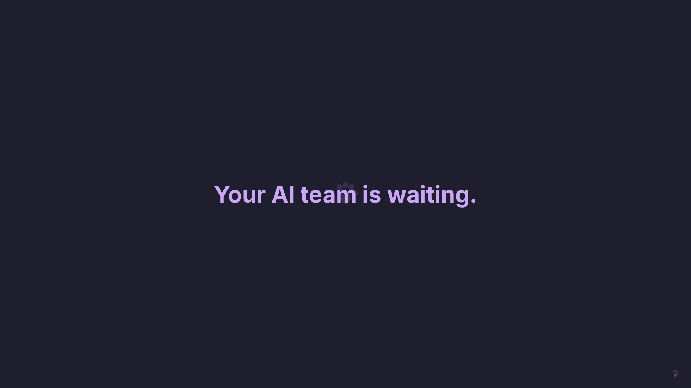
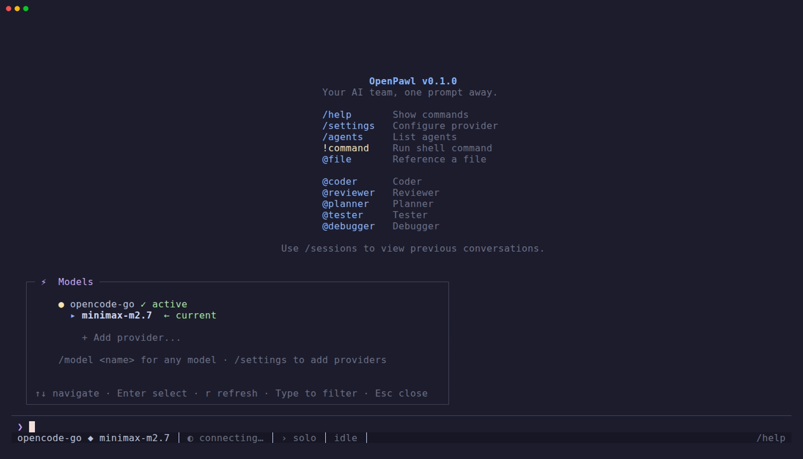
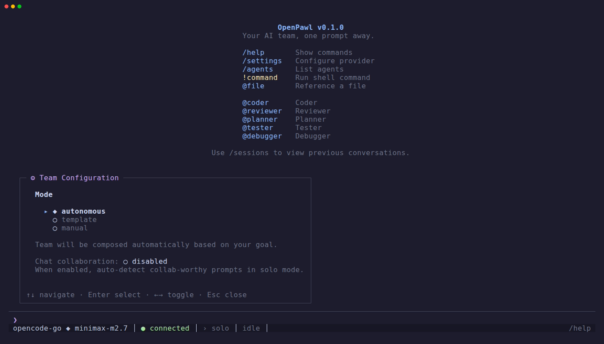
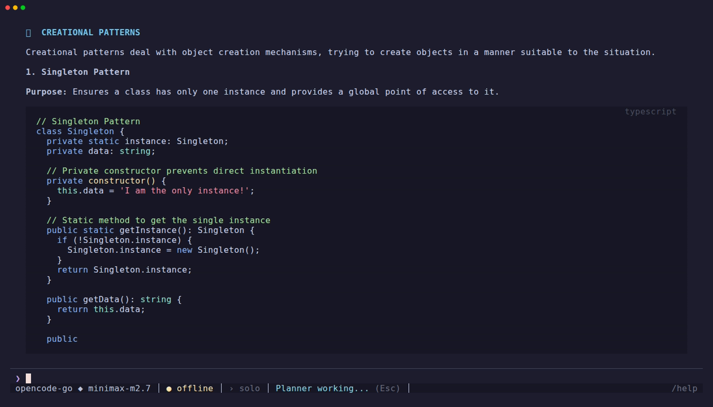
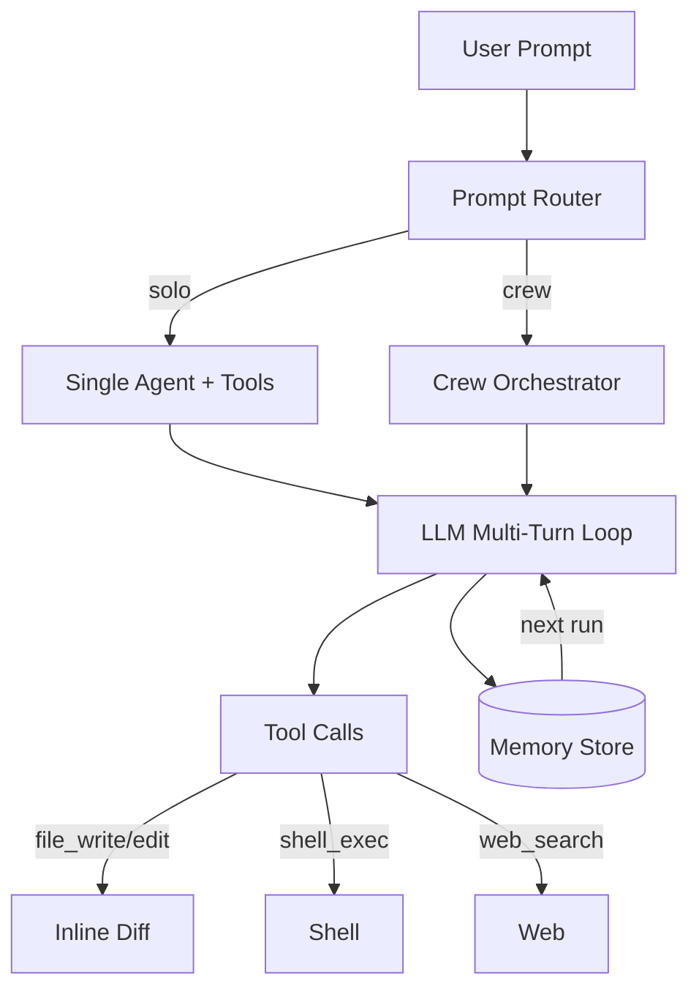

<p align="center">
  
</p>

# OpenPawl

**Terminal AI coding with a team of agents, not just one. Chat-based, keyboard-first, open source.**

[](https://github.com/codepawl/openpawl/actions/workflows/ci.yml)
[](./LICENSE)
[](https://nodejs.org)
[](https://www.typescriptlang.org)
[](#)
[](#)

OpenPawl orchestrates a team of specialized AI agents toward your goals — with memory, learning, and structure that persists across sessions.

## The Problem

Vibe coding alone is a grind. Every session starts from scratch:

```
Before OpenPawl:                    After OpenPawl:
───────────────────────────────     ──────────────────────────────
Prompt into the void            →   Persistent team memory
Re-explain context every time   →   Instant session briefing
Make decisions alone            →   Structured debate + review
Forget why you chose X          →   Decision journal
Repeat the same mistakes        →   Global lessons learned
Ship things you're unsure of    →   Confidence-gated delivery
No structure                    →   Sprint cadence with standup
```

OpenPawl replaces that friction with a team that remembers, learns, and holds itself accountable.

## Screenshots

> All screenshots from real sessions using **opencode-go** provider with **minimax-m2.7** model.

### Welcome



*Interactive TUI with slash commands, agent mentions, and status bar.*

### Model & Provider Selection



*Switch providers and models on the fly. 15+ providers supported.*

### Team Templates



*5 built-in team templates. Pick a team or let OpenPawl compose autonomously.*

### Crew Mode

A team of agents — planner, coder, reviewer, tester — works together on the goal. Tier-1 observability streams every subagent's tool calls into the TUI tree so you can watch the run, not just wait on it. See **Crew Mode** below or [docs/CREW.md](./docs/CREW.md) for the full guide.

### Escape to Cancel



*Press Escape to stop any response mid-stream. Partial output preserved.*

## Install

```bash
curl -fsSL https://raw.githubusercontent.com/codepawl/openpawl/main/install.sh | sh
```

**Requirements:** Node.js >= 20, bun, and an LLM API key (Anthropic, OpenAI, OpenRouter, DeepSeek, Groq, or local Ollama).

## Quickstart

```bash
openpawl setup                    # guided setup wizard
openpawl                          # launch interactive TUI
openpawl standup                  # daily summary
openpawl think "SSE or WebSocket?" # rubber duck mode
```

The bare `openpawl` command launches the interactive TUI in solo mode. For unattended runs:

```bash
openpawl run --headless --goal "Build auth" --mode solo --runs 2
```

## Features

### Execution Modes

| Mode | How it works | Status |
|------|-------------|--------|
| **Solo** | Single agent responds to prompts with tool calling | ✅ Working |
| **Crew** | Multi-agent: planner decomposes → tier-gated phases → discussion meeting → drift supervisor | ✅ Working (rc.1) |

Cycle modes with `Shift+Tab` in the TUI; pick a mode with `--mode` in headless (`--mode solo` wired; crew runs end-to-end inside the TUI).

### Team Orchestration

7 built-in agents (coder, reviewer, planner, tester, debugger, researcher, assistant) are defined and ready to be exercised by crew mode. Agents use keyword-based routing and confidence-gated delivery.

Team composition is flexible: pick agents manually, let the system compose autonomously based on your goal, or use one of 5 built-in templates. Custom agents can be created and configured via `/agents` in the TUI. Agent profiles track performance across runs.

### Memory and Learning

The team remembers across sessions. Success patterns get stored in LanceDB — future runs retrieve what worked. Failures feed a post-mortem loop so mistakes don't repeat. Every architectural decision is logged in a searchable decision journal. Hebbian memory strengthens associations between concepts based on co-activation.

### Developer Tools

- **Session briefing** — "previously on OpenPawl" context every time you start
- **Daily standup** — what was done, what's blocked, what's next
- **Rubber duck mode** — structured debate from multiple perspectives
- **Drift detection** — flags when a new goal contradicts past decisions
- **Goal clarity checker** — challenges vague goals before planning begins
- **Context handoff** — auto-generates CONTEXT.md at session end
- **Inline diffs** — colored unified diffs on file writes/edits in TUI and headless
- **Post-mortem learning** — extracts lessons across runs, injects into future planning

### Terminal UI

- **Rich TUI** — keyboard navigation, Catppuccin Mocha theme, mouse support
- **Escape to cancel** — stop any streaming response mid-flight
- **Token counter** — live input/output token tracking in the status bar
- **Type-to-filter** — filter in all list views (agents, templates, sessions)
- **Centralized keybindings** — view and customize via `/hotkeys`
- **Min terminal size handling** — graceful degradation on small terminals
- **Context compression** — automatic compaction keeps context growth < 1x

### Observability and Control

- **Audit trail** — full decision log exported as markdown
- **Replay mode** — re-run any past session for debugging
- **Agent heatmap** — find utilization bottlenecks across runs
- **Cost forecasting** — estimate cost before a run starts
- **Performance profiler** — opt-in timing breakdown of the full pipeline
- **Headless mode** — `openpawl run --headless` with `--mode`, `--template`, `--workdir`, `--runs`
- **Provider/model sync** — single source of truth across agents and modes

## Crew Mode

Crew mode runs a team of agents on a single goal: a planner decomposes the task, agents execute phase tiers in parallel where the dependency graph allows, a discussion meeting fires before tier 3 to surface disagreement, and a drift supervisor halts the run when later phases contradict earlier decisions.

**Enter crew mode** — launch `openpawl`, press `Shift+Tab` to cycle from solo to crew. The status bar shows the active mode.

**Built-in preset** — `full-stack` ships with four agents: Planner, Coder, Reviewer, Tester. Each has its own write_scope and tool capabilities. Run `openpawl crew show full-stack` to inspect.

**Custom crews** — fork a built-in and edit:

```bash
openpawl crew clone full-stack my-team
openpawl crew edit my-team             # opens manifest.yaml in $EDITOR
openpawl crew validate my-team         # check before running
```

CLI surface:

| Command | Description |
|---------|-------------|
| `crew list` | List built-in + user crews |
| `crew show <name>` | Print manifest YAML and agent prompts |
| `crew create <name>` | Interactive crew creation |
| `crew edit <name>` | Open manifest in `$EDITOR` |
| `crew clone <built-in> <new>` | Fork a bundled preset |
| `crew validate <name>` | Validate manifest |
| `crew delete <name>` | Remove a user crew (built-ins are protected) |

Inside a crew run, `/pause`, `/continue`, `/skip <id>`, `/reorder`, `/abort` operate on the live phase loop. See [docs/CREW.md](./docs/CREW.md) for the full guide and [docs/design/crew-v0.4.md](./docs/design/crew-v0.4.md) for the design spec.

## Team Templates

Pre-built teams you can install and use immediately:

```bash
openpawl templates browse                          # list available templates
openpawl templates install indie-hacker             # install a template
openpawl run --headless --template indie-hacker \
  --goal "Build auth system"                        # use in headless mode
```

Or use `/team` in the TUI to browse and switch templates interactively.

| Template | Pipeline |
|----------|----------|
| `content-creator` | Research, Script, SEO, Review |
| `indie-hacker` | Architect, Engineer, QA, RFC |
| `research-intelligence` | Research, Verify, Synthesize |
| `business-ops` | Process, Automate, Document |
| `full-stack-sprint` | Frontend, Backend, DevOps, Lead |

Five seed templates ship offline. Community templates at [openpawl-templates](https://github.com/codepawl/openpawl-templates).

## CLI Reference

**Getting started:**

| Command | Description |
|---------|-------------|
| `setup` | Guided setup wizard |
| `check` | Verify setup is working |
| `demo` | Demo mode — see OpenPawl in action (no API key needed) |

**Daily workflow:**

| Command | Description |
|---------|-------------|
| `solo` | Interactive solo mode (single agent) |
| `run` | Headless mode (`--headless --goal "..." --mode solo --runs N --workdir <path>`) |
| `standup` | Daily standup summary |
| `think` | Rubber duck mode — structured debate |
| `clarity` | Check goal clarity |

**Team and providers:**

| Command | Description |
|---------|-------------|
| `templates` | Browse, install, and manage team templates |
| `model` | LLM selection: list, set, per-agent overrides |
| `providers` | Configure and test LLM providers |
| `agent` | Add and manage custom agents |
| `crew` | Manage crews — list, show, create, edit, delete, validate, clone |
| `settings` | View and change settings |
| `config` | Configuration management (get/set/unset) |

**Memory and decisions:**

| Command | Description |
|---------|-------------|
| `journal` | Decision journal: list, search, show, export |
| `drift` | Detect goal vs decision conflicts |
| `lessons` | Export lessons learned |
| `handoff` | Generate or import CONTEXT.md |
| `memory` | Global memory: health, promote, export |

**History and analysis:**

| Command | Description |
|---------|-------------|
| `replay` | Replay past sessions for debugging |
| `audit` | Export audit trail |
| `heatmap` | Agent utilization heatmap |
| `forecast` | Estimate run cost before execution |
| `diff` | Compare runs within or across sessions |
| `score` | Vibe coding score and trends |
| `profile` | Agent performance profiles |
| `sessions` | Session management |

**Utilities:**

| Command | Description |
|---------|-------------|
| `cache` | Response cache management |
| `logs` | View session and gateway logs |
| `clean` | Remove session data (preserves memory) |
| `update` | Self-update to latest version |

**TUI slash commands** (inside the interactive app):

| Command | Description |
|---------|-------------|
| `/mode` | Switch between solo and crew |
| `/team` | Browse and switch team templates |
| `/agents` | List and configure agents (CRUD) |
| `/hotkeys` | View and customize keybindings |
| `/debate` | Multi-perspective analysis |
| `/research` | Deep research mode |
| `/settings` | App settings |
| `/status` | Provider and system status |
| `/compact` | Toggle compact/expanded view |
| `/setup` | Re-run setup wizard |

## Architecture



Solo mode dispatches a single agent through an LLM multi-turn loop with native tool calling. Crew mode runs a 12-node graph: planner → tier-gated phase executor → optional discussion meeting → drift supervisor → context compaction → Hebbian-injection — see [docs/CREW.md](./docs/CREW.md) for the runtime, [docs/design/crew-v0.4.md](./docs/design/crew-v0.4.md) for the design spec. Memory: LanceDB vector store + hebbian associative layer carries patterns and lessons across runs. Context compression keeps long conversations within token limits.

## Comparison

| Feature | OpenPawl | Claude Code | OpenCode | Aider |
|---------|----------|-------------|----------|-------|
| Multi-agent orchestration | Crew mode + solo | Single agent | Single agent | Single agent |
| Cross-session memory | LanceDB vector + hebbian | Per-project CLAUDE.md | None | Git-based |
| Post-mortem learning | Extracts & injects lessons | None | None | None |
| Team templates | 5 built-in + custom | None | None | None |
| Inline file diffs | Colored unified diffs | Built-in | None | Git diff |
| Decision journal | Searchable, drift detection | None | None | None |
| Cost forecasting | 3 methods + learning curves | None | None | None |
| Interactive TUI | Custom (Catppuccin, mouse) | Built-in | Bubbletea | Terminal |
| Headless mode | `--mode`, `--template`, `--runs` | Non-interactive | CLI only | CLI only |
| Agent heatmap | Utilization + bottleneck | None | None | None |

OpenPawl focuses on multi-agent workflows and persistent learning. For single-agent coding tasks, Claude Code and Aider are more mature. For a detailed feature comparison, see [docs/comparison.md](./docs/comparison.md).

## Tech Stack

| Layer | Technology |
|-------|------------|
| Runtime | Node.js >= 20, Bun |
| Terminal UI | Custom TUI engine (Catppuccin Mocha theme) |
| LLM engine | Native API tool calling, multi-turn streaming |
| LLM providers | Anthropic, OpenAI, AWS Bedrock, Vertex AI, OpenRouter, Ollama |
| Vector memory | LanceDB (embedded) |
| Diff engine | LCS-based line diff (no external deps) |
| Validation | Zod |
| Build | tsup + Vite (web client) |
| Tests | Bun test runner (475 tests) |
| JSON parsing | Safe JSON parser with recovery |

Pure TypeScript (ESM). No Python. 437 source files, ~63.5k LOC.

## Development

```bash
bun install          # install dependencies
bun run dev          # watch mode
bun run build        # production build (tsup + web client)
bun run typecheck    # type-check (tsc --noEmit)
bun run test         # run tests (bun test)
bun run lint         # lint (eslint src/)
```

Pre-commit hook runs typecheck → lint → tests automatically.

## Security

- Config at `~/.openpawl/config.json` may contain API tokens
- Agent output is untrusted — review before applying to production
- Global memory at `~/.openpawl/memory/global.db` — back it up

See [SECURITY.md](./SECURITY.md) for vulnerability reporting.

## Documentation

| Document | Contents |
|----------|----------|
| [AGENTS.md](./docs/AGENTS.md) | Team culture and RFC policy |
| [WEBHOOKS.md](./docs/WEBHOOKS.md) | Webhook event schemas |
| [comparison.md](./docs/comparison.md) | Feature comparison with other tools |

## License

[MIT](./LICENSE)
