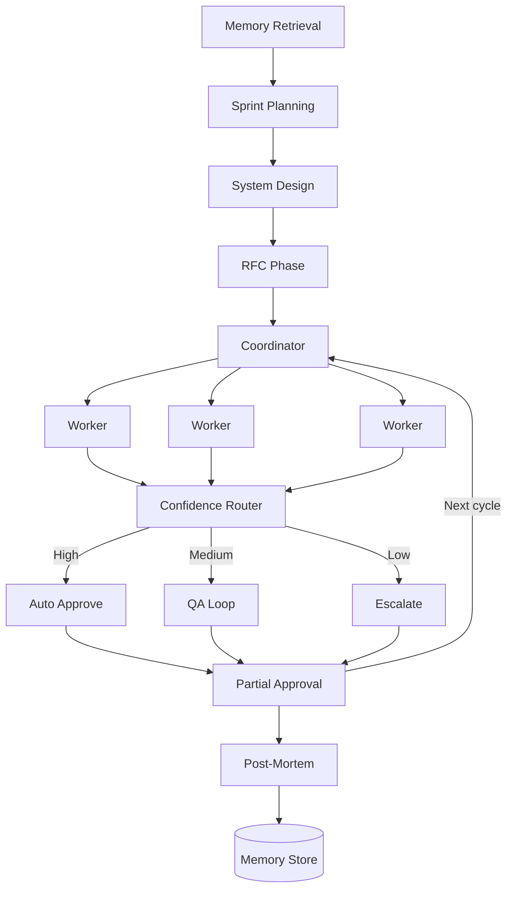

# OpenPawl

**Your AI team for vibe coding. Stop prompting alone.**

[](./LICENSE)
[](https://nodejs.org)
[](https://www.typescriptlang.org)

OpenPawl orchestrates a team of specialized AI agents toward your goals — with memory, learning, and structure that persists across sessions.

---

## The Problem

Vibe coding alone is a grind. Every session starts from scratch:

```
Before OpenPawl:                    After OpenPawl:
───────────────────────────────     ──────────────────────────────
Prompt into the void            →   Persistent team memory
Re-explain context every time   →   Instant session briefing
Make decisions alone            →   Structured debate + review
Forget why you chose X          →   Decision journal
Repeat the same mistakes        →   Global lessons learned
Ship things you're unsure of    →   Confidence-gated delivery
No structure                    →   Sprint cadence with standup
```

OpenPawl replaces that friction with a team that remembers, learns, and holds itself accountable.

---

## Install

```bash
curl -fsSL https://raw.githubusercontent.com/codepawl/openpawl/main/install.sh | sh
```

**Requirements:** Node.js >= 20, bun, and an LLM API key (Anthropic, OpenAI, OpenRouter, DeepSeek, Groq, or local Ollama).

---

## Quickstart

```bash
openpawl setup                    # guided setup wizard
openpawl work --goal "Build auth" # start a sprint
openpawl standup                  # daily summary
openpawl think "SSE or WebSocket?" # rubber duck mode
```

The dashboard opens automatically at `http://localhost:8000`. A rich terminal UI (TUI) is also available for keyboard-driven workflows.

---

## Features

### Team Orchestration

11 specialized agents collaborate through a 12-node LangGraph pipeline: Coordinator, Worker Bot, Sprint Planner, System Designer, RFC Author, Post-Mortem Analyst, Retrospective, Memory Retrieval, Human Approval, Partial Approval, and Review Workflow. Independent tasks execute in parallel via the LangGraph Send API. Agents self-report confidence — uncertain work auto-routes to QA or rework. Good tasks get approved individually while bad ones go back.

Team composition is flexible: pick agents manually, let the system compose autonomously based on your goal, or use a pre-built template. You can build custom agents via `@openpawl/sdk` and plug them in. Agent profiles track performance across runs and inform routing decisions.

### Memory and Learning

The team remembers everything across sessions. Success patterns get stored in LanceDB — future runs retrieve what worked. Failures feed a post-mortem loop so mistakes don't repeat. Every architectural decision is logged in a searchable decision journal. Global patterns persist across all sessions forever.

### Solo Developer Tools

- **Session briefing** — "previously on OpenPawl" context every time you start
- **Daily standup** — what was done, what's blocked, what's next
- **Rubber duck mode** — structured debate from two perspectives without starting a sprint
- **Drift detection** — flags when a new goal contradicts past decisions
- **Goal clarity checker** — challenges vague goals before planning begins
- **Context handoff** — auto-generates CONTEXT.md at session end
- **Vibe coding score** — mirror showing how you collaborate with your team
- **Async thinking** — submit a question before sleep, wake up to analysis
- **Interactive chat** — conversational mode with your agent team

### Observability and Control

- **Real-time dashboard** — Kanban, Eisenhower matrix, live graph, cost tracking
- **Terminal UI** — rich TUI with keyboard navigation, themes, and mouse support
- **Audit trail** — full decision log exported as markdown
- **Replay mode** — re-run any past session for debugging
- **Agent heatmap** — find utilization bottlenecks across runs
- **Cost forecasting** — estimate cost before a run starts
- **Webhook approval** — Slack/email approval for unattended runs
- **MCP server** — Model Context Protocol integration for external tool access

---

## Template Marketplace

Pre-built teams you can install and use immediately:

```bash
openpawl templates browse
openpawl templates install indie-hacker
openpawl work --template indie-hacker --goal "Build auth system"
```

| Template | Pipeline |
|----------|----------|
| `content-creator` | Research, Script, SEO, Review |
| `indie-hacker` | Architect, Engineer, QA, RFC |
| `research-intelligence` | Research, Verify, Synthesize |
| `business-ops` | Process, Automate, Document |
| `full-stack-sprint` | Frontend, Backend, DevOps, Lead |

Five seed templates ship offline. Community templates at [openpawl-templates](https://github.com/codepawl/openpawl-templates).

---

## CLI Reference

| Command | Description |
|---------|-------------|
| `setup` | Guided setup wizard |
| `check` | Verify setup is working |
| `work` | Start a work session (`--runs N`, `--template <id>`) |
| `standup` | Daily standup summary |
| `think` | Rubber duck mode — structured debate |
| `chat` | Interactive chat with agent team |
| `clarity` | Check goal clarity |
| `config` | Manage configuration (get/set/unset) |
| `model` | LLM selection: list, set, per-agent overrides |
| `providers` | Configure and test LLM providers |
| `web` | Start/stop/status dashboard server |
| `templates` | Browse, install, publish marketplace templates |
| `agent` | Manage custom agents |
| `journal` | Decision journal: list, search, show, export |
| `score` | Vibe coding score and trends |
| `replay` | Replay past sessions for debugging |
| `audit` | Export audit trail |
| `forecast` | Estimate run cost before execution |
| `heatmap` | Agent utilization heatmap |
| `diff` | Compare runs within or across sessions |
| `memory` | Global memory: health, promote, export |
| `cache` | Response cache management |
| `profile` | Agent performance profiles |
| `drift` | Detect goal vs decision conflicts |
| `handoff` | Generate or import CONTEXT.md |
| `lessons` | Export lessons learned |
| `sessions` | Session management |
| `logs` | View session and gateway logs |
| `demo` | Demo mode (no API key needed) |
| `clean` | Remove session data (preserves memory) |
| `update` | Self-update to latest version |

---

## Agent Architecture



12-node LangGraph pipeline. Workers execute in parallel via Send API. The confidence router auto-approves high-confidence work, loops uncertain tasks through QA, and escalates failures. Post-mortem extracts lessons into vector memory for future runs.

---

## Dashboard

Real-time SSE dashboard at `localhost:8000`:

- Kanban board with task pipeline
- Eisenhower priority matrix
- Live LangGraph node execution view
- Summary cards: tasks, cost, confidence
- Memory, replay, journal, heatmap, and score tabs
- LLM request log with streaming progress
- Interactive approval modal for human-in-the-loop
- Light, dark, and system themes with custom palettes

---

## Tech Stack

| Layer | Technology |
|-------|------------|
| Orchestration | LangGraph.js |
| Web server | Fastify + SSE |
| Frontend | React, Tailwind CSS, Vite |
| Terminal UI | Custom TUI (ink-style) |
| Vector memory | LanceDB (embedded) |
| LLM providers | Anthropic, OpenAI, AWS Bedrock, Vertex AI, OpenRouter |
| Validation | Zod |
| Build | tsup + bun |
| Tests | Vitest |
| CLI prompts | @clack/prompts |

Pure TypeScript / Node.js. No Python.

---

## Development

```bash
bun install          # install dependencies
bun run dev          # watch mode
bun run build        # production build (tsup + web client)
bun run typecheck    # type-check
bun run test         # run tests (Vitest)
bun run lint         # lint (eslint src/)
bun run web          # start dashboard server
bun run work         # start work session with dashboard
```

---

## Security

- Dashboard has **no built-in auth** — bind to `127.0.0.1`
- Config at `~/.openpawl/config.json` may contain API tokens
- Agent output is untrusted — review before applying to production
- Global memory at `~/.openpawl/memory/global.db` — back it up

See [SECURITY.md](./SECURITY.md) for vulnerability reporting.

---

## Documentation

| Document | Contents |
|----------|----------|
| [AGENTS.md](./docs/AGENTS.md) | Team culture and RFC policy |
| [ARCHITECTURE.md](./docs/ARCHITECTURE.md) | System design |
| [CUSTOM_AGENTS.md](./docs/CUSTOM_AGENTS.md) | Custom agent SDK guide |
| [WEBHOOKS.md](./docs/WEBHOOKS.md) | Webhook event schemas |

---

## License

[MIT](./LICENSE)
